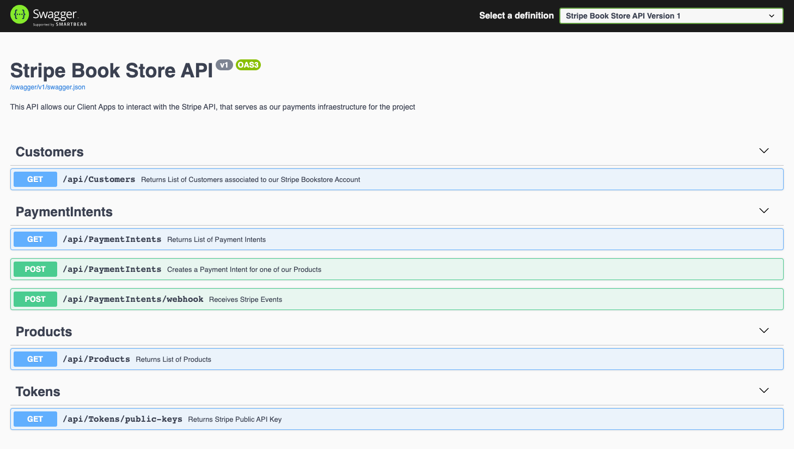

# StripeBookStore
Simple e-commerce application, that allows a customer to purchase a book utilizing Stripe as our Payments infrastructure. The solution consist of 2 main projects (Backend server and Mobile client apps for iOS and Android):

### About Solution
The solution leverages `Stripe’s .NET` Library, which is used on the server side to handle creating payment intents for products selected in the client app; thus providing a client secret that allows our users to confirm their payments on the client once they have created and selected a valid card payment method. I used the **Stripe Payments and PaymentMethod API's** for the basic InMemory Data Flow.

You can also enable an **optional flow** using Products stored on your test Stripe account that makes use of the **Products, and Prices API's** to get the most up to date price for the product before the purchase is complete.

The Client Apps users are notified in realtime that a successful charge has been made by using a Webhook that listens to the "charge.succeeded" StripeEvent in conjunction with a `SignalR` Hub.

| iOS | Android |
| :--: | :--: |
||  |

[Stripe Book Store - Adobe XD Project](Artwork/StripeBookStore.xd)

#### Setup Demo
- **Create .env** file in root of `StripeBookStore.API` project, that contains your Stripe account Keys. (Secret Key, Publishable Key and Webhook Secret Key)
```env
STRIPE_PUBLISHABLE_KEY=<replace-with-your-publishable-key>
STRIPE_SECRET_KEY=<replace-with-your-secret-key>
STRIPE_WEBHOOK_SECRET_KEY=<replace-with-your-secret-key>
```
- **Run** Backend Server solution `StripeBookStore.API`
```bash
cd StripeBookStore.API
dotnet run
```


- **Listen and Forward** Stripe Webhook events to our local server, in order for the payment confirmation to work.
Make sure to install the [Stripe CLI](https://stripe.com/docs/stripe-cli) and [link your Stripe account](https://stripe.com/docs/stripe-cli#link-account):
```bash
stripe listen --forward-to http://localhost:42424/api/PaymentIntents/webhook
```
The CLI will print a webhook secret key to the console. Set `STRIPE_WEBHOOK_SECRET` to this value in your .env file.

#### Platforms Supported

|Platform|Version|
| ------------------- | :------------------: |
|ASP .NET Core| 3.1 |
|Xamarin.Forms| 5.0+|
|Xamarin.iOS|iOS 11+|
|Xamarin.Android|API 21+|

#### Solution Structure


### Challenges
In order to complete the assignment, I had to **learn all the fundamentals about Stripe** how their payment infrastructure works. The initial challenge I faced was not having worked previously with the product but I was really pleased to have found alot of great documentation, guides and a extensive API reference I could leverage to get an understanding of the product and the common payment use cases it supports.

I decided to use `Xamarin.Forms` as my client app solution and found that **Stripe does not have official up to date Xamarin Bindings** for their iOS and Android Native SDK's, I could not leverage their prebuilt UI's unless I wanted to invest time on creating the Xamarin Bindings and create the abstractions to use it seamlessly from the Shared Xamarin.Forms project, I felt this was out of scope for this project and decided to use the .NET Stripe Library, build custom screens and implement the payment flow accordingly.

### Extending the project into a more robust instance
The current state of the project is not production ready and is more of a POC than a MVP, I would recommend extending it with the following improvements:
- Server:
    - Payments:
        - **Add Endpoints** to manage products, customers and payment methods with Stripe API's instead of In-Memory Data.
    - Data:
        - **Design and Implement Data Layer** - define database model, entities, and persist and sync data with Stripe.
        - **Add Caching**
    - Authentication:
        - **Add Security to REST API**
        - **Create User Authentication Endpoints**
        
- Client Apps: 
    - UI/UX Improvements:
        - **Add Search & Filters for Books Catalog Page** - Allow user to search and filter the list of books.
        - **Add Product Details Page** - Allow the user to get an extended description, specifications, view multiple images and reviews about the product before commiting to purchase.
        - **Extend Payment Flow** in Client Apps from "Select a book > Checkout > Add Payment Method > Purchase Item" instead the app should also have:
            - **Cart Page** - Allows the users to CRUD their own collection of products to purchase.
            - **Add Shipping Method Page** - Allows user to set a shipping Address and get shipping options to complete order.
            - **Persist Payment Methods** - Allow users to save their payment methods and reuse when needed.
            - **Payment Method Validation with Stripe 3D Secure** - For banks that require validation, project should handle it gracefully.
        - **Issue Refunds** - Alows user to issue refunds for orders he has placed under a certain period of time.
        - **Send Email Receipts** - Users receive an email receipt of their purchase.
        - **Localization** - App should be localized for all the markets it wishes to support.
        - **Authentication Flow** - Users should be able to register and sign in to the app before being able to purchase (User must have a stripe customer associated to support features other features of stripe like saving payment methods, shipping method, and associating transactions to the account).
        - **Implement Analytics and Crash reporting** - Leverage AppCenter to collect realtime crashes and user events data from our client apps.
        - **Refactor Implementation of SignalR** - Polish implementation of SignalR on client and server, to cover cases like sending charge notification to specific users.

## Useful References for completing project
- [Stripe API Reference](https://stripe.com/docs/api?lang=dotnet)
- [Online Payments guides - Stripe](https://stripe.com/docs/payments/cards/overview)
- [Payment Method guides - Stripe](https://stripe.com/docs/payments/payment-methods/overview)
- [Event Types - Stripe](https://stripe.com/docs/api/events/types)
- [Webhooks guide - Stripe](https://stripe.com/docs/webhooks/build)
- [.NET Core Starter - Stripe Office Hours](https://www.youtube.com/watch?v=2-mMOB8MhmE)

## Dev Tools Used
- [Stripe CLI](https://stripe.com/docs/stripe-cli)
- [Stripe Extension - Visual Studio Code](https://stripe.com/docs/stripe-vscode#:~:text=Stripe's%20extension%20for%20Visual%20Studio,use%20Stripe%20within%20your%20editor.)
- [Visual Studio For Mac 2019](https://visualstudio.microsoft.com/vs/mac/)

## Resources
Mobile App
- [Xamarin](https://docs.microsoft.com/xamarin/?WT.mc_id=mobile-0000-bramin) - build native apps for Android, iOS, and macOS using .NET code and platform-specific user interfaces
- [Xamarin.Essentials](https://docs.microsoft.com/xamarin/essentials/?WT.mc_id=mobile-0000-bramin) - provides cross-platform APIs for their mobile applications
- [Xamarin.Forms](https://docs.microsoft.com/xamarin/get-started/what-is-xamarin-forms?WT.mc_id=mobile-0000-bramin) - an open-source UI framework to build Android, iOS, and Windows applications from a single shared codebase
- [Prism.DryIoC]() - Prism is a framework for building loosely coupled, maintainable, and testable XAML applications in Xamarin Forms, I'm using the DryIoC DI container for this project. 
- [AsyncAwaitBestPractices](https://github.com/brminnick/AsyncAwaitBestPractices) - Extensions for System.Threading.Tasks.Task
- [Refit](https://github.com/reactiveui/refit) - Refit is a REST library for .NET that converts REST APIs into live interfaces
- [Sharpnado.MaterialFrame](https://github.com/roubachof/Sharpnado.MaterialFrame) - A modern Xamarin.Forms Frame component supporting blur, acrylic, dark mode. Implemented with RealtimeBlurView on Android (custom blurview) and UIVisualEffectView on iOS.
- [Stripe.NET](https://github.com/stripe/stripe-dotnet) - The official Stripe .NET library, supporting .NET Standard 2.0+, .NET Core 2.0+, and .NET Framework 4.6.1+.

Backend
- [.NET Core](https://docs.microsoft.com/dotnet/core/?WT.mc_id=mobile-0000-bramin) - an [open-source](https://github.com/dotnet/core), general-purpose development platform maintained by Microsoft and the .NET community on [GitHub](https://github.com/dotnet/core)
- [ASP.NET Core](https://docs.microsoft.com/en-us/aspnet/core/?view=aspnetcore-3.1) - supports creating RESTful services, also known as web APIs, using C#. [GitHub](https://github.com/dotnet/aspnetcore)
- [Polly + HttpClientFactory](https://docs.microsoft.com/dotnet/architecture/microservices/implement-resilient-applications/implement-http-call-retries-exponential-backoff-polly?WT.mc_id=mobile-0000-bramin) - the recommended approach for retries with exponential backoff is to take advantage of more advanced .NET libraries
- [Refit + HttpClientFactory](https://docs.microsoft.com/aspnet/core/fundamentals/http-requests?WT.mc_id=mobile-0000-bramin#generated-clients) - `IHttpClientFactory` can be used in combination with third-party libraries such as Refit
- [Stripe.NET](https://github.com/stripe/stripe-dotnet) - The official Stripe .NET library, supporting .NET Standard 2.0+, .NET Core 2.0+, and .NET Framework 4.6.1+.
- [ASP .NET Core SignalR](https://docs.microsoft.com/en-us/aspnet/signalr/overview/getting-started/introduction-to-signalr) is a library for ASP .NET developers that simplifies the process of adding real-time functionality to applications.